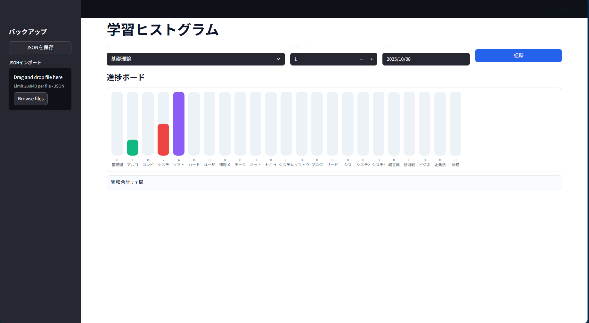

# 学習ヒストグラム（Streamlit）

学習項目の周回数をローカル JSON に保存し、カラー縦棒（||||）で一望表示します。  
保存先: `progress.json`（ローカルのみ／公開リポジトリにはコミットしない想定）

## スクリーンショット


## セットアップ
```bash
python -m venv .venv
# Windows
.venv\Scripts\activate
# macOS/Linux
source .venv/bin/activate
pip install -r requirements.txt
